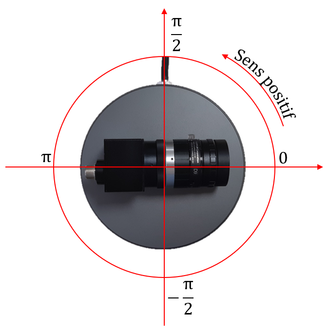

# Documentation de stage - Paul Thebault - Été 2021
### _Détection et prédiction d'obstacles avec caméra et lidar_

Stage de 4e année informatique à l'INSA Toulouse, effectué dans le département Génie Électronique et Informatique

## Objectifs

- Rendre autonome un tricycle, en particulier côté capteurs
- À l'aide d'une caméra et d'un lidar, détecter des obstacles
- Avec l'historique des positions des obstacles, prédire leurs trajectoires futures
- Tout cela dans de l'informatique embarquée sur le tricycle

## Technologies utilisées

- [Jetson Nano] - Mini-ordinateur et kit de développement
- [ROS] - Middleware de robotique open-source, permet d'interfacer les capteurs
  - [`usb_cam`] - Gère les caméra USB, comme son nom l'indique
  - [`rslidar_sdk`] - SDK du lidar utilisé, développé par le constructeur, qui est un paquet ROS
- [Lidar RoboSense] - Lidar 16 couches, envoie ses données par UDP

[Jetson Nano]: <https://developer.nvidia.com/embedded/jetson-nano-developer-kit>
[ROS]: <https://wiki.ros.org>
[`usb_cam`]: <https://wiki.ros.org/usb_cam>
[`rslidar_sdk`]: <https://github.com/RoboSense-LiDAR/rslidar_sdk>
[Lidar RoboSense]: <https://www.robosense.ai/en/rslidar/RS-LiDAR-16>

## Jetson Nano

### Présentation

La carte Jetson Nano est un mini-ordinateur, similaire à une carte Raspberry Pi, mais avec un processeur graphique en plus. Cela permet de faire des calculs plus poussés, tout en restant très compact. Les caractéristiques techniques sont disponible sur le [site de Nvidia](https://developer.nvidia.com/embedded/jetson-nano-developer-kit).

### Matériel disponible avec la carte (normalement)

- Alimentation 5V
- Carte microSD
- Carte WiFi intégrée, sûrement pas d'origine (adresse MAC `94:E7:0B:C6:DD:4C`)
- Carte WiFi USB, plus puissante (adresse MAC `74:DA:38:E8:74:D8`)
- Caméra de Raspberry Pi, connectique CSI
- Caméra USB, de meilleure définition (jusqu'à 2304 x 1536 pixels)

### Matériel nécessaire

- Écran HDMI ou DisplayPort
- Clavier et souris USB
- Un ordinateur pour réinstaller l'OS éventuellement

### Configuration / Réinstallation

- L'OS a été installé en suivant les instruction de cette [page du site Nvidia](https://developer.nvidia.com/embedded/learn/get-started-jetson-nano-devkit)
- La date et l'heure n'étaient pas automatiquement réglées, causant des problèmes lors d'installations ou autre. Voir section suivante.

### Fix du problème d'horloge

La date et l'heure semblent réinitialisées à chaque redémarrage de la carte. Après recherche et expérimentation, j'ai opté pour une solution non-idéale mais fonctionnelle :

J'ai ajouté [ce script](https://gist.github.com/pthebaul/1c20c731084c9429f644971f16980dec) dans le répertoire `/etc/network/if-up.d/`. Il est exécuté lorsqu'une interface réseau est connectée. Si l'heure n'a pas encore été configurée et que la carte a accès à Internet, une reqûete HTTP est effectuée afin d'en récupérer la date et l'heure, qui sont alors utilisées pour régler l'horloge de la carte. Un fichier `date-set` est ensuite créé dans le répertoire `/var/run/`, qui est vidé à chaque redémarrage. Cela permet de ne régler l'heure qu'une seule fois par démarrage.

## ROS

### Présentation

ROS (_Robot Operating System_) est un logiciel _open source_ très utilisé en robotique, permettant d'interfacer des capteurs et des actionneurs. Contrairement à ce que son nom indique, ce n'est pas un système d'exploitation, mais un _middleware_, qui permet de lier entre eux plusieurs logiciels (de traitement de données de capteurs par exemple).

ROS est également un ensemble de _packages_ eux aussi _open source_. Ils peuvent servir à faire le lien avec un capteur ou un actionneur, peuvent être à l'interface ou au traitement des données, ou encore être des visualisateurs de données.

**Note :** il existe également ROS 2, qui est développé en parallèle de ROS 1 (communément appelé ROS). Cette version 2 vise à améliorer fondamentalement ROS, puisque ROS 1 est développé sous certaines hypothèses (robot unique, réseau fiable, etc.). J'ai préféré rester sur ROS 1, pour des soucis de disponibilités de _packages_ et de stabilité.

### Installation, configuration et prise en main

Le wiki de ROS contient un [tutoriel très complet](https://wiki.ros.org/ROS/Tutorials), également disponible [en français](https://wiki.ros.org/fr/ROS/Tutorials). Il permet de prendre en main les commandes ROS, de comprendre le fonctionnement de ROS (_nodes_, _topics_, etc.), et montre même comment écrire du code pour ROS.

Voici quelques concepts qu'il peut être utile de connaître :
- [rosbridge](https://wiki.ros.org/rosbridge_suite) - Permet d'utiliser ROS sur plusieurs ordinateurs distincts.
- [rosbag](https://wiki.ros.org/rosbag) - Permet d'enregistrer toutes les données transitant par ROS afin de les rejouer plus tard. Cela permet de créer un cas de test et d'enregistrer les données des capteurs sans avoir à rejouer la scène à chaque fois.
- [rviz](https://wiki.ros.org/rviz) - Visualisateur 3D pour ROS très complet.
- [tf2](https://wiki.ros.org/tf2) - Gère les relations entre les différents référentiels d'un système (la position du robot par rapport à son environnement, celle de la caméra par rapport au lidar, etc.)

## Caméras

### Détection de la caméra et test
La commande bash `ls /dev/video*` affiche la liste des caméras détectées par la carte, ou plutôt la liste des identifiants (le nombre accollé à `/dev/video`). Exemple avec les deux caméras (USB et Raspberry Pi) :
```
$ ls /dev/video*
/dev/video0 /dev/video1
```

La commande `v4l2src` peut donner plus d'informations sur une caméra connectée, grâce à l'option `--list-formats_ext` :
```
$ v4l2src --device=/dev/video0 --list-formats-ext
ioctl: VIDIOC_ENUM_FMT
        Index       : 0
        Type        : Video Capture
        Pixel Format: 'RG10'
        Name        : 10-bit Bayer RGRG/GBGB
                Size: Discrete 3264x2464
                        Interval: Discrete 0.048s (21.000 fps)
                Size: Discrete 3264x1848
                        Interval: Discrete 0.036s (28.000 fps)
                Size: Discrete 1920x1080
                        Interval: Discrete 0.033s (30.000 fps)
                Size: Discrete 1640x1232
                        Interval: Discrete 0.033s (30.000 fps)
                Size: Discrete 1280x720
                        Interval: Discrete 0.017s (60.000 fps)
```

Pour tester les caméras, il est possible d'utiliser `gstreamer`, qui est un _framework_ multimédia _open source_. Ici, nous allons nous en servir pour afficher l'image de la caméra à l'écran :

Pour les caméras CSI (comme la caméra Raspberry Pi) :
```
$ gst-launch-1.0 nvarguscamerasrc sensor-id=<id> ! nvvidconv ! xvimagesink
```
Pour les caméras USB (compatibles, comme celle fournie) :
```
gst-launch-1.0 v4l2src device=/dev/video<id> ! video/x-raw,width=1920 ! xvimagesink
```
Si cela ne fonctionne pas, il peut être utile d'essayer les autres **ids** de caméra. Pour la caméra USB, il faudra peut-être changer la largeur de l'image, dont la valeur doit être parmi celles affichées par `v4l2src`.

Par défaut, si la caméra Raspberry Pi et la caméra USB sont branchées à la carte, alors elles auront respectivement 0 et 1 comme ids.

### Intégration à ROS (USB seulement, non documenté pour CSI)
Pour envoyer l'image de la caméra à travers ROS, il existe un _package_ tout trouvé, qui s'appelle [`usb_cam`]. Comme la plupart des _packages_ ROS, il peut s'installer simplement avec la commande `apt-get` :
```
sudo apt-get install ros-melodic-usb-cam
```
(il faudra remplacer `melodic` par la version utilisée de ROS si elle est différente)

Ce _package_ implémente un nœud ROS bien documenté sur [la page du wiki de ROS](https://wiki.ros.org/usb_cam), ainsi qu'un fichier `.launch` contenant un nœud `usb_cam` ainsi qu'un nœud `image_view` permettant d'afficher l'image à l'écran.

### Calibration
Les caméras doivent être calibrées afin de corriger les éventuels distorsions. Pour cela, il faut utiliser [ce _package_ ROS](https://wiki.ros.org/camera_calibration), et un damier. Lorsque la caméra aura suffisamment filmé le damier dans des positions variées, le _package_ s'occupera de calculer les distorsions, et d'en générer un fichier utilisable par ROS.
J'ai déjà effectué la calibration de la caméra USB, et les fichiers sont disponibles sur ce dépôt.

## Lidar

### Matériel disponible dans la boîte

- Lidar 16 couches avec câble
- Bloc d'interface avec câble
- Câble d'alimentation
    - Câble d'alimentation C13 classique
    - Bloc transformateur avec câble
- Câble Ethernet
- Housse pour le lidar
- 3 vis de tailles différentes

### Installation
0.  Lire le [manuel d'utilisateur](https://lidence.com/wp-content/uploads/2019/07/RS-Lidar-16Users-Guide_v4.0.pdf)
1.  Brancher le câble Ethernet du bloc d'interface à la carte Jetson Nano
2.  Positionner le lidar à l'emplacement souhaité
3.  Brancher le câble d'alimentation au bloc d'interface

Le lidar commence alors à tourner et scanner ses environs. Il essaye alors d'envoyer en permanance ses données à travers le câble Ethernet. Il utilise le protocole UDP, et utilise par défaut l'adresse IP `192.168.1.200`, avec pour adresse IP de destination `192.168.1.102`. Plus d'informations sont disponibles dans le manuel d'utilisateur.

### Configuration de la Jetson Nano
Il donc configurer l'interface réseau de la Jetson Nano :
```
$ ifconfig eth0 192.168.1.102
```

Ensuite, il faut installer et configurer le _package_ ROS fourni par RoboSense. Pour cela, il suffit de suivre les instructions du Readme du [dépôt GitHub](https://github.com/RoboSense-LiDAR/rslidar_sdk).

### Utilisation avec ROS

Le _package_ implémente un nœud ROS ainsi qu'un fichier `.launch` permettant de lancer ce même nœud ainsi qu'un nœud `rviz` pré-configuré. Le nuage de points est alors visible et il est possible de se déplacer dans l'espace.

## `rviz` et `tf2`

`rviz` est un visualisateur 3D, qui a donc besoin de savoir où sont les différents objets dans l'espace. Pour cela, `rviz` écoute les _topics_ sur lesquels le _package_ `tf2` diffuse les relations entre les référentiels.

Par défaut, `rviz` va donc afficher des avertissements, en l'absence de configuration de tf2. Il est possible d'utiliser un nœud ROS de `tf2_ros`, `static_transform_publisher`, afin de placer les capteurs par rapport au "monde" :
```
$ rosrun tf2_ros static_transform_publisher x y z yaw pitch roll id_parent id_enfant
```

### Relation entre la caméra et le lidar
Pour rapidement voir les données des deux capteurs se superposer, il est possible de poser la caméra sur le lidar de manière orthogonale. Il suffit ensuite de noter l'angle en radians, comme le montre le schéma suivant :


La commande pour `tf2` est alors :
```
$ rosrun tf2_ros static_transform_publisher 0 0 0 -1.57 0 <rotation> rslidar usb_cam
```
Note : -1,57 est ici une valeur approchée de pi, à affiner à votre convenance.

La manière idéale de définir cette relation entre capteurs serait de procéder à une calibration. Comme pour la caméra, cela consistera à utiliser un _package_ ainsi qu'un damier ou un ARTag. Je n'ai pas effectué cette calibration, mais deux _packages_ semblent prometteur pour cette opération : [celui de heethesh](https://github.com/heethesh/lidar_camera_calibration) et [celui de ankitdhall](https://github.com/ankitdhall/lidar_camera_calibration).


## Bibliographie

### Sur la prédiction de trajectoires piétonnes
Papiers et recueils utilisés :
- https://github.com/jiachenli94/Awesome-Interaction-aware-Trajectory-Prediction
- https://github.com/xuehaouwa/Awesome-Trajectory-Prediction
- https://arxiv.org/abs/1905.06113
- https://arxiv.org/abs/1809.00696
- https://www.cs.cmu.edu/~jiyanpan/papers/lncs06.pdf
- https://www.diva-portal.org/smash/record.jsf?pid=diva2%3A953092&dswid=-8253
- https://www.researchgate.net/figure/The-Predictive-Mobile-Target-Tracking-algorithm-process_fig2_310795552
- https://www-sciencedirect-com.gorgone.univ-toulouse.fr/science/article/pii/S0262885618300283

Le résumé d'une étude de certains de ces papiers est disponible dans le fichier [bibliographie.md](bibliographie.md).

### Sur les LSTM
- https://ieeexplore.ieee.org/stamp/stamp.jsp?tp=&arnumber=279181
- https://penseeartificielle.fr/comprendre-lstm-gru-fonctionnement-schema/
- https://medium.com/smileinnovation/lstm-intelligence-artificielle
- https://machinelearningmastery.com/gentle-introduction-long-short-term-memory-networks-experts/
- https://towardsdatascience.com/illustrated-guide-to-lstms-and-gru-s-a-step-by-step-explanation

Un court diaporama illustré sur les LSTM est disponible dans le fichier [LSTM.pptx](LSTM.pptx).
